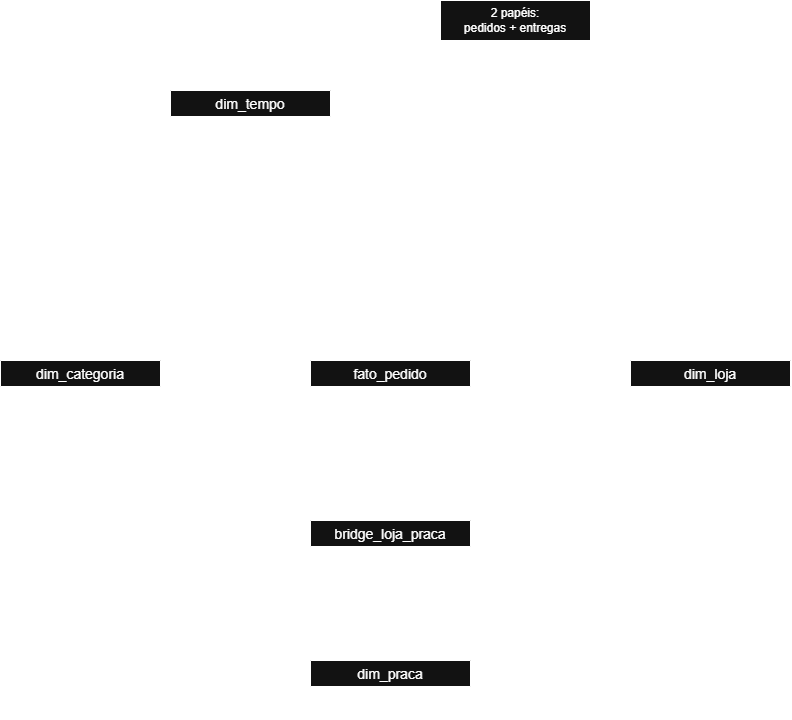

# Análise de Dados com Python [T2]
## Projeto Avaliativo - Pata Amiga

**Aluno:** Eric Felipe Barros Marques  
**Turma:** Análise de Dados com Python [T2]  

## Sobre o projeto

Este é um mini-projeto avaliativo de análise de dados com Python e SQL.
A Pata Amiga é uma rede catarinense de pet shops com 32 lojas.
O desafio é responder cinco perguntas de negócio usando dados de 4.044 pedidos 
coletados entre setembro de 2023 e março de 2024.

Os dados chegam em três sistemas diferentes, com grafias inconsistentes, 
formatos mistos e relacionamentos complexos.

## Objetivo

Construir um modelo dimensional (estrela) que unifique os dados e permita 
responder:

1. Onde está o gargalo da entrega?
2. Qual categoria concentra o faturamento?
3. O desconto funciona igual em todo canal?
4. Qual praça de atendimento concentra o faturamento?
5. Onde abrir a próxima loja?

## Tecnologias Utilizadas

- **Banco de dados**: MySQL
- **Modelagem**: Schema em Estrela (Dimensional)


## Arquitetura

### Modelo Dimensional



Grão da fato: 1 linha = 1 pedido (4.044 linhas)

Dimensões:
- dim_tempo: data em número (20230916)
- dim_loja: cadastro das 32 lojas
- dim_categoria: 7 categorias padronizadas
- dim_praca: 13 praças de atendimento

Bridge:
- bridge_loja_praca: relacionamento N:N com fator de rateio

### Dados de entrada

Três tabelas staging (não alteráveis):
- stg_pedido: 4.044 linhas com os pedidos e marcos de entrega
- stg_loja: 32 linhas com o cadastro das lojas de hoje
- stg_loja_praca: 48 linhas com loja × praça e percentual do público

### Deficiências encontradas nas tabelas staging
 
A base chegou com dados de três sistemas diferentes, cada um escrevendo do seu jeito:
 
| Deficiência | Quantidade | Impacto |
|------------|-----------|--------|
| Grafias diferentes de categoria | 18 | 18 formas diferentes para 7 categorias padrão |
| Grafias diferentes de loja | 50 | Nomes com acentos, abreviações, erros de digitação |
| Pedidos sem Cod Loja | 1575 (~39%) | Necessário fazer lookup por nome |
| Pedidos sem nome de loja | 3 | 3 pedidos vão para a linha -1 |
| Marcos de separação em branco | 1077 | Processo ainda em aberto |
| Marcos de nota fiscal em branco | 1338 | Processo ainda em aberto |
| Marcos de despacho em branco | 1665 | Processo ainda em aberto |
| Marcos de entrega em branco | 1953 | 1.953 pedidos ainda não entregues |


### Exemplos de grafias problemáticas
 
**Categorias**:
- "Ração", "RACAO", "Rac.", "Alimento Seco" → categoria "Racao"
- "Ração Medicamentosa" → categoria "Medicamento" (não é ração!)

**Lojas**:
- "PATA AMIGA BLUMENAL CENTRO" → deveria ser "PATA AMIGA BLUMENAU CENTRO" (erro de digitação)
- "PATA AMIGA FLORIPA NORTE" → deveria ser "PATA AMIGA FLORIANOPOLIS NORTE" (apelido)
- "PATA AMIGA JGUA DO SUL" → deveria ser "PATA AMIGA JARAGUA DO SUL" (abreviação)

**Valores monetários**:
- "R$ 1.850,00" (com ponto de milhar e vírgula decimal)
- "1850.00" (formato americano)
- "1.200" (milhar sem decimal)
- "" ou "-" (valores ausentes)

**Datas**:
- DtHoraPedido: "09/01/2023 10:07 AM" (formato americano MM/DD/AAAA)
- Marcos de entrega: "2023-09-02" (formato ISO AAAA-MM-DD)


## Decisões de Tratamento (Tarefa 2)

### Conversão de datas

| Coluna | Formato de entrada | Máscara SQL |
|--------|-------------------|------------|
| DtHoraPedido, DtHoraIntegracaoERP | "09/01/2023 10:07 AM" | `STR_TO_DATE(coluna, '%m/%d/%Y %h:%i %p')` |
| Os 4 marcos (Sep, Nota, Desp, Ent) | "2023-09-02" | `DATE(coluna)` |
| Chave da dim_tempo | 20230901 | `CAST(DATE_FORMAT(data, '%Y%m%d') AS SIGNED)` |

**Atenção crítica**: usar `'%d/%m/%Y'` na coluna de data americana devolve NULL e datas trocadas em silêncio. Sempre usar `'%m/%d/%Y'`.

### Conversão de valores monetários

Regra geral:
- Vazio ou "-" → NULL (nunca 0, pois AVG ignora NULL mas soma zero)
- "R$ 1.850,00" → tire "R$", espaço, ponto de milhar, troque vírgula por ponto → 1850.00
- "1850.00" → já está pronto
- "1.200" → tire o ponto antes de converter → 1200

### De-para de categorias

**Ordem crítica**: "Ração Medicamentosa" contém "RA", então testei "MED" antes de "RA".

| Ordem | Se contém | Resultado |
|-------|-----------|-----------|
| 1 | MED | Medicamento |
| 2 | PETISC | Petisco |
| 3 | RA | Racao |
| 4 | HIG | Higiene |
| 5 | BRINQ | Brinquedo |
| 6 | ACESS | Acessorio |
| 7 | SERV | Servico |
| - | nenhum | Nao Informado |

### Padronização de desconto e canal

**Desconto** (valores que aparecem):
- S, SIM, 1, X, TRUE, V → "Sim"
- N, NAO, 0, FALSE, F → "Nao"
- vazio ou outro → "Nao Informado"

**Canal** (ordem crítica - "WHATSAPP" contém "APP"):
- WHATS → "WhatsApp"
- APP → "App"
- SITE → "Site"
- LOJA → "Loja Fisica"
- TEL → "Telefone"
- nenhum → "Nao Informado"

 
## Execução do Projeto
 
### Pré-requisitos
 
Antes de começar, certifique-se de ter:
 
- MySQL 8.0 ou superior instalado e rodando
- Acesso a um banco de dados (ou permissão para criar um)
- Git instalado (para versionamento)
- Editor de texto ou IDE SQL (MySQL Workbench, DBeaver, VS Code com extensão SQL, etc)

### Preparação do Ambiente
 
#### 1. Clonar o Repositório
 
```bash
git clone https://github.com/EricMarques/miniProjetoAvaliativoModuloDois.git
cd miniProjetoAvaliativoModuloDois
```
 
#### 2. Criar o Banco de Dados
 
No MySQL, execute:
 
```sql
CREATE DATABASE dw_pata_amiga CHARACTER SET utf8mb4 COLLATE utf8mb4_unicode_ci;
USE dw_pata_amiga;
```
 
---
 
### Execução dos Scripts SQL
 
Os scripts **devem ser executados em ordem**. Cada um depende do anterior.
 
#### Via MySQL Workbench ou DBeaver
 
1. Abra sua ferramenta SQL
2. Conecte ao banco `dw_pata_amiga`
3. Abra cada arquivo SQL em ordem:
   - `pipelines/01-carga-staging.sql`
   - `pipelines/02-dimensoes-prontas.sql`
   - `pipelines/03-dimensoes.sql`
   - `pipelines/04-fato.sql`
   - `pipelines/05-perguntas.sql`
4. Execute cada script (Ctrl+Enter ou botão de play)
5. Valide com `pipelines/00-conferencia.sql` após cada etapa


## Respostas às cinco perguntas


### P1: Onde está o gargalo da entrega?
- Qual o tempo médio, em dias, entre o pedido entrar no ERP e chegar na casa do cliente?
- E qual dos quatro intervalos do processo  Integração → Separação, Separação → Nota, Nota → Despacho, Despacho → Entrega é o mais lento?
- O gargalo é o mesmo nos três portes de loja?

**Tempo médio (em dias) por porte de loja:**
 
| Porte | Integração→Separação | Separação→Nota Fiscal | Nota Fiscal→Despacho | Despacho→Entrega | **Total (ERP→Entrega)** |
|-------|----------------------|-----------------|----------------|------------------|----------------------|
| Grande | 2.1 | 0.6 | 3.3 | 2.0 | 8.0 |
| Pequena | 3.1 | 0.7 |	8.5 | 2.9 |	15.3 |
| Nao Informado | 2.0 | 0.0 | 4.0 | 3.0 | 8.5 |
| Média | 2.1 |	0.6 | 3.3 |	2.0 | 8.1 |

### O QUE CADA COLUNA SIGNIFICA
 
| Coluna | Significado |
|--------|-------------|
| **Porte da Loja** | Tamanho da loja: Não Informado, Pequena, Média ou Grande |
| **Integração → Separação** | Dias desde o pedido chegar no ERP até a separação em estoque |
| **Separação → Nota Fiscal** | Dias para gerar a nota fiscal após separação |
| **Nota Fiscal → Despacho** | Dias para entregar à transportadora após nota fiscal (GARGALO!) |
| **Despacho → Entrega** | Dias do despacho até chegar na casa do cliente |
| **TOTAL (ERP→Entrega)** | Dias totais desde o pedido até a entrega (soma dos 4 intervalos) |

 
**Análise crítica**: Observando os dados, vejo que lojas pequenas levam praticamente o dobro de tempo que lojas grandes (15,3 dias contra 8,0 dias). O problema não está distribuído - está concentrado num único lugar: entre a nota fiscal e o despacho. Lojas pequenas gastam 8,5 dias aí, enquanto as grandes fazem em 3,3 dias.

Isso representa mais da metade do tempo total (55,6%) nas lojas pequenas. Quando comparo com lojas maiores, o processo fica muito mais rápido - a diferença é clara.

Os outros intervalos não variam muito. A integração ERP é rápida em todo lugar (~2 dias), e a entrega pela transportadora também é consistente (~2,5-3 dias). O problema é definitivamente operacional, depois que o pedido é faturado.

Minha hipótese é que lojas pequenas têm menos gente ou talvez agrupem pedidos em lotes para separação. Lojas grandes provavelmente têm sistemas diferentes ou mais automatizados.

Se conseguir reduzir os 8,5 dias para 4 dias nesse intervalo crítico, as lojas pequenas sairiam de 15,3 dias para cerca de 10 dias - uma melhoria de 35%.

**Resumo**: O gargalo está no intervalo Nota→Despacho, especialmente em lojas pequenas (8,5 dias). Lojas pequenas levam 15,3 dias do ERP até a entrega, enquanto grandes levam 8,0 dias - praticamente o dobro.

### P2: Qual categoria concentra o faturamento?
- Do faturamento total da rede, quanto vem de cada categoria de produto?
- Agrupe pelo nome padronizado, nunca pela grafia crua, e mostre também o percentual do total.
- A categoria campeã é a mesma nos três portes de loja?


**Faturamento por categoria:**
 
| Categoria | Grupo | Faturamento | % do Total |
|-----------|-------|-------------|-----------|
| Racao | Alimentacao | R$1076202.55 | 60.01% |
| Medicamento | Saude e Higiene | R$305904.03 | 17.06% |
| Petisco | Alimentacao | R$128590.16 | 7.17% |
| Servico | Bem-estar | R$94001.37 | 5.24% |
| Higiene | Saude e Higiene | R$92314.45 | 5.15% |
| Acessorio | Bem-estar | R$64661.39 | 3.61% |
| Brinquedo | Bem-estar | R$31634.56 | 1.76% |

### O QUE CADA COLUNA SIGNIFICA
 
| Coluna | Significado |
|--------|-------------|
| **Categoria** | Nome padronizado da categoria (7 total) |
| **Grupo** | Agrupamento maior (Alimentação, Saúde e Higiene, Bem-estar) |
| **Faturamento (R$)** | Valor total vendido em reais, arredondado em 2 casas |
| **% do Total** | Percentual que essa categoria representa do faturamento total da rede |

 
**Análise crítica**: Olhando para os números, fica bem claro que a Pata Amiga é fundamentalmente um negócio de comida para pets. Ração sozinha representa 60% do faturamento. Se somar ração com petisco, chego a 67% - mais de duas terços do negócio.

Isso não é coincidência. Comida é consumo recorrente - o dono compra toda semana ou a cada duas semanas. Acessórios e brinquedos são compra eventual.

O segundo lugar é medicamento (17%), que também é essencial quando o pet fica doente. Serviço fica com 5%, o que é interessante - significa que a rede oferece banho/tosa, mas não é o foco.

Quando penso em estratégia, isso muda tudo. Se a margem de lucro em ração for baixa, o negócio inteiro pode estar comprometido. Se for alta, a rede tem um modelo bem sustentável. As lojas que conseguem vender mais ração tendem a ter melhor faturamento.

A pergunta que não consigo responder com estes dados é: será que todas as lojas vendem o mesmo mix? As lojas pequenas vendem proporcionalmente mais ração que as grandes? Ou há diferenças regionais? Mas para agora, o padrão está claro: ração domina.


**Resumo**: Ração domina com 60% do faturamento. Somando ração + petisco, chega a 67%.
A Pata Amiga é fundamentalmente um negócio de comida para pets, não acessórios.

- Grupo **"Alimentação"** (Ração + Petisco): 57,42%
- Grupo **"Saúde e Higiene"** (Higiene + Medicamento): 23,13%
- Grupo **"Bem-estar"** (Acessório + Serviço + Brinquedo): 20,51%
 

**Faturamento total da rede**: R$ 1.793.308,51

### P3: O desconto funciona igual em todo canal?
- Compare o ticket médio COM e SEM desconto dentro de cada canal de venda (App, Site, Loja Física, Telefone, WhatsApp).
- Se o desconto derruba o ticket em um canal e não em outro, a política não deveria ser a mesma nos dois.
- Diga também quanto cada canal representa do faturamento.

**Ticket médio com e sem desconto por canal:**
 
| Canal | Ticket médio | Ticket médio com desconto | Ticket médio sem desconto | Percentual do faturamento |
|-------|-------------------|--------------|--------------|--------------|
| App | R$433.73 | R$470.92 | R$162.39 | 30.79% |
| Site | R$436.60 | R$484.23 | R$184.69 | 25.13% |
| Loja Fisica | R$437.72 | R$481.65 | R$189.73 | 20.11% |
| WhatsApp | R$455.75 | R$502.23 | R$176.06 | 10.52% |
| Telefone | R$467.50 | R$506.94 | R$195.23 | 6.88% |
| Nao Informado | R$497.17 | R$539.35 | R$191.62 | 6.57% |


### O QUE CADA COLUNA SIGNIFICA
 
| Coluna | Significado |
|--------|-------------|
| **Canal** | Canal onde o pedido foi realizado |
| **Ticket médio** | Ticket médio considerando todos os pedidos do canal |
| **Ticket médio com desconto** | Ticket médio dos pedidos que tiveram desconto |
| **Ticket médio sem desconto** | Ticket médio dos pedidos que não tiveram desconto |
| **Percentual do faturamento** | Participação do canal no faturamento total |


**Análise crítica**: Os números mostram que o desconto tem impacto completamente diferente dependendo do canal.

No App, quando o cliente vê um desconto, o ticket cai de R$ 471 para R$ 162 - uma queda de 65%. Parece muito, mas isso pode ser porque no App o desconto atrai clientes que compram pouco. No Site é similar: cai de R$ 484 para R$ 185, também 62%.

Loja Física é parecido: de R$ 482 para R$ 190 (60%).

Mas WhatsApp é interessante: cai de R$ 502 para R$ 176, mas essa queda de 65% acontece com ticket base muito maior. Telefone tem a mesma história - ticket grande, desconto derruba bastante, mas sempre para um patamar baixo.

O que me chamou atenção: o desconto não retém o cliente no mesmo patamar em nenhum canal. Quem compra com desconto compra bem menos caro. Parece que desconto atrai cliente diferente, não cliente leal pagando menos.

Se a política é a mesma em todos os canais, ela deveria ser revista. App e Site têm 56% do faturamento junto - se o desconto ali está muito agressivo, vale testar algo diferente. Talvez cupom com mínimo de compra, ou desconto apenas em segunda compra.

**Resumo**: O desconto tem impacto similar em todos os canais (queda de 60-65%), mas atrai clientes que compram bem menos.

Sugere que a política deveria ser revista - talvez cupom com mínimo de compra em vez de desconto direto.

### P4: Qual praça de atendimento concentra o faturamento?
- Atenção: uma loja entrega em mais de uma praça.
- O rateio precisa ser feito pelo percentual do público, e a soma por praça tem de fechar com o faturamento da rede.
- Cruze o faturamento rateado com o número de domicílios com pet de cada praça

**Faturamento rateado por praça (com fator de rateio):**
 
| Praça | Região | Domicílios com animais | Faturamento rateado | Percentual do faturamento |
|-------|----------|-------------------|------------|-----------|
| Vale do Itajai | Regional Leste | 148000 | R$633746.09 | 35.34% |
| Grande Florianopolis | Regional Leste | 132000 | R$283546.75 | 15.81% |
| Norte Industrial | Regional Norte | 96000 | R$175431.90 | 9.78% |
| Litoral Sul | Regional Sul | 58000 | R$137051.20 | 7.64% |
| Litoral Norte | Regional Norte | 61000 | R$128872.75 | 7.19% |
| Extremo Oeste | Regional Oeste | 63000 | R$98359.18 | 5.48% |
| Carbonifera | Regional Sul | 67000 | R$88707.42 | 4.95% |
| Serra Catarinense | Regional Oeste | 44000 | R$80477.64 | 4.49% |
| Meio-Oeste | Regional Oeste | 51000 | R$58955.63 | 3.29% |
| Foz do Itajai | Regional Leste | 74000 | R$46749.72 | 2.61% |
| Planalto Norte | Regional Norte | 33000 | R$31100.84 | 1.73% |
| Planalto Serrano | Regional Oeste | 29000 | R$29323.10 | 1.64% |
 

### O QUE CADA COLUNA SIGNIFICA
 
| Coluna | Significado |
|--------|-------------|
| **Praça** | Praça de atendimento relacionada à loja |
| **Região** | Regional à qual a praça pertence |
| **Domicílios com animais** | Quantidade de domicílios com animais na praça |
| **Faturamento rateado** | Faturamento atribuído à praça após aplicar o fator de rateio |
| **Percentual do faturamento** | Participação da praça no faturamento total |


**Análise crítica**: Vale do Itajaí concentra 35% do faturamento, o que faz sentido - é uma região maior com 148 mil domicílios com pet. Grande Florianópolis vem depois com 16%, também região grande.

Mas quando penso em eficiência por capita, o ranking muda. A questão é: estamos cobrindo bem todas as praças, ou há oportunidades de crescimento em regiões sub-penetradas?

Vale do Itajaí gera muito volume porque é uma região grande. Já está bem coberta. As regiões menores têm tempo de entrega similar às grandes (todos ao redor de 7-9 dias), então não é problema de logística.

O que vejo é que temos presença em 12 praças diferentes, o que é bom para distribuição. Nenhuma praça fica sem atendimento. Mas também nenhuma está absolutamente dominada pela rede - sempre há espaço para crescimento.

A recomendação natural seria abrir ou expandir em praças onde temos potencial ainda não explorado. Mas isso já é decisão de negócio, não apenas dados.

**Resumo**: 
Vale do Itajaí lidera com 35% do faturamento. A rede tem presença em 12 praças diferentes, bem distribuída. Nenhuma praça está super-dominada - todas têm espaço para crescimento.
 
**Validação**: A soma do faturamento rateado + pedidos sem loja:
A soma do faturamento rateado por praça (R$ 1.792.322) + pedidos sem loja (R$ 986) = R$ 1.793.308, que fecha exatamente com o total da rede da P2

| Total da fato | Total rateado por praça | Faturamento sem loja | Diferença |
|-------|----------|-------------------|-----------|
| 1793309 | 1792322 | 986 | 0 |

### O QUE CADA COLUNA SIGNIFICA
| Coluna | Significado |
|--------|-------------|
| Total da fato | Faturamento total registrado na tabela fato_pedido |
| Total rateado por praça | Faturamento distribuído entre as praças utilizando o fator_publico |
| Faturamento sem loja | Faturamento dos pedidos que não possuem uma loja associada (sk_loja = -1) |
| Diferença | Valor restante após descontar do faturamento total o valor rateado pelas praças e o faturamento sem loja |

### P5: Onde abrir a próxima loja?
a) Ranqueie as lojas por itens vendidos por mil habitantes da cidade  não em valor absoluto  e cruze com o tempo médio de entrega. 

b) A faixa de franquia no cadastro é a de hoje: o passado foi sobrescrito. Mostre o faturamento por faixa ATUAL e explique por que isso não responde “quanto veio de lojas que JÁ ERAM Ouro na data do pedido”.

c) Meça o que ficou de fora: pedidos sem loja identificada, entregas ainda não concluídas, itens e valores em branco.


#### (a) Ranking por itens por mil habitantes
 
**Melhorias potenciais** (lojas com maior densidade de vendas):
 
| Posição | Loja | Cidade | População da cidade | Itens Totais | Itens por mil habitantes | Tempo médio de entrega (dias) |
|---------|------|--------|-----------|-------------|---------------|-------------------|
| 1º | Pata Amiga Rio dos Cedros	Rio dos | Cedros |	11322 |	61 |	5.39 |	14.3 |
| 2º | Pata Amiga Presidente Getulio	Presidente | Getúlio |	16359 |	88 |	5.38 |	14.3 |
| 3º | Pata Amiga Ibirama |	Ibirama |	18613 |	98 |	5.27 |	15.5 |
| 4º | Pata Amiga Itapoa |	Itapoá |	20586 |	84 |	4.08 |	15.5 |
| 5º | Pata Amiga Santo Amaro da Imperatriz	Santo Amaro da | Imperatriz |	22357 |	85 |	3.80 |	16.0 |
| 6º | Pata Amiga Taio |	Taió |	18173 |	59 |	3.25 |	14.6 |
| 7º | Pata Amiga Timbo |	Timbó |	45011 |	123 |	2.73 |	7.8 |
| 8º | Pata Amiga Gaspar |	Gaspar |	71133 |	181 |	2.54 |	8.1 |
| 9º | Pata Amiga Otacilio Costa	Otacílio | Costa |	18227 |	44 |	2.41 |	15.7 |
| 10º | Pata Amiga Rio do Sul	Rio do | Sul |	73135 |	149 |	2.04 |	8.5 |
| 11º | Pata Amiga Ituporanga |	Ituporanga |	25748 |	51 |	1.98 |	16.6 |
| 12º | Pata Amiga Indaial |	Indaial |	71987 |	128 |	1.78 |	7.8 |
| 13º | Pata Amiga Laguna |	Laguna |	46122 |	80 |	1.73 |	8.7 |
| 14º | Pata Amiga Sao Joaquim	São | Joaquim |	27234 |	45 |	1.65 |	15.2 |
| 15º | Pata Amiga Ararangua |	Araranguá |	68274 |	107 |	1.57 |	8.3 |
| 16º | Pata Amiga Tubarao |	Tubarão |	105511 |	157 |	1.49 |	7.8 |
| 17º | Pata Amiga Jaragua do Sul	Jaraguá do | Sul |	184579 |	239 |	1.29 |	8.2 |
| 18º | Pata Amiga Sao Bento do Sul	São Bento do | Sul |	87310 |	105 |	1.20 |	8.3 |
| 19º | Pata Amiga Curitibanos |	Curitibanos |	39061 |	47 |	1.20 |	8.8 |
| 20º | Pata Amiga Concordia |	Concórdia |	74641 |	89 |	1.19 |	7.8 |
| 21º | Pata Amiga Xanxere |	Xanxerê |	52034 |	54 |	1.04 |	8.2 |
| 22º | Pata Amiga Palhoca |	Palhoça |	168259 |	172 |	1.02 |	7.8 |
| 23º | Pata Amiga Sao Miguel do Oeste	São Miguel do | Oeste |	41520 |	42 |	1.01 |	8.1 |
| 24º | Pata Amiga Blumenau Centro |	Blumenau |	361855 |	315 |	0.87 |	7.9 |
| 25º | Pata Amiga Brusque |	Brusque |	143270 |	122 |	0.85 |	7.7 |
| 26º | Pata Amiga Criciuma |	Criciúma |	217392 |	152 |	0.70 |	8.2 |
| 27º | Pata Amiga Lages |	Lages |	158846 |	107 |	0.67 |	7.8 |
| 28º | Pata Amiga Chapeco |	Chapecó |	254235 |	159 |	0.63 |	8.0 |
| 29º | Pata Amiga Sao Jose Kobrasol	São | José |	250181 |	155 |	0.62 |	8.1 |
| 30º | Pata Amiga Itajai Praia |	Itajaí |	264054 |	159 |	0.60 |	8.1 |
| 31º | Pata Amiga Joinville Sul |	Joinville |	597658 |	309 |	0.52 |	7.9 |
| 32º | Pata Amiga Florianopolis Norte |	Florianópolis |	537213 |	275 |	0.51 |	8.1 |

### O QUE CADA COLUNA SIGNIFICA
| Coluna | Significado |
|--------|-------------|
| Loja | Nome da loja analisada |
| Cidade | Cidade onde a loja está localizada |
| População da cidade | População utilizada como base para calcular o indicador |
| Itens totais | Quantidade total de pedidos/itens registrados para a loja |
| Itens por mil habitantes | Quantidade de itens para cada mil habitantes da cidade |
| Tempo médio de entrega (dias) | Tempo médio necessário para realizar as entregas da loja |

 
#### (b) Faturamento por faixa de franquia (foto de HOJE)
 
| Faixa de franquia | Faturamento | Percentual do total | Número de Lojas |
|-------|------------|-----------|-----------------|
| Bronze | R$84036.06 | 4.69% | 4 |
| Prata | R$314812.03 | 17.55% | 8 |
| Ouro | R$1011264.38 | 56.39% | 15 |
| Diamante | R$382209.74 | 21.31% | 5 |

### O QUE CADA COLUNA SIGNIFICA
| Coluna | Significado |
|--------|-------------|
| Faixa de franquia | Classificação atual da loja em relação à franquia |
| Faturamento | Faturamento total dos pedidos associados à faixa |
| Percentual do total | Participação da faixa no faturamento total |
| Número de lojas | Quantidade de lojas distintas pertencentes à faixa |

 
**Limitação crítica**: Este número **NÃO responde** "quanto veio de lojas que **JÁ ERAM** Ouro na data do pedido" porque:
- O cadastro (stg_loja) só tem a **foto de hoje** (31/03/2024)
- Os pedidos foram de **setembro 2023 a março 2024**
- Uma loja que era Bronze em setembro pode ser Ouro em março
- Não há histórico de quando a faixa mudou


#### (c) Dados que ficaram de fora
 
| O que ficou de fora | Quantidade | Faturamento |
|-------------------|-----------|------------|
| Pedidos sem loja identificada | 3	| R$986.30  |
| Entregas ainda não concluídas | 1953 | R$	873892.40 |
| Itens em branco ou zero | 257 | R$119711.86 |
| Valores em branco ou zero | 121 | - |

### O QUE CADA COLUNA SIGNIFICA
| Coluna | Significado |
|--------|-------------|
| O que ficou de fora | Tipo de informação que apresenta algum problema ou ausência |
| Quantidade | Quantidade de registros encontrados em cada situação |
| Faturamento | Valor financeiro associado aos registros encontrados |


**Análise crítica**: Quando olho o ranking de lojas, Rio dos Cedros lidera com 5,39 itens por mil habitantes. É uma cidade pequena (11 mil pessoas) mas vende bem. Rio dos Cedros, Presidente Getúlio e Ibirama ficam nos três primeiros - tudo cidades pequenas com alta densidade de vendas.

Depois a sequência desce: Itapoá (4,08), Santo Amaro (3,80), Taió (3,25). Conforme as cidades ficam maiores, a densidade cai. Blumenau com 361 mil habitantes tem só 0,87 itens por mil - está abaixo da média.

Isso pode significar duas coisas. Ou cidades pequenas têm clientes mais engajados (talvez menos concorrência), ou as lojas pequenas estão super-saturadas e mal comportam mais volume.

Florianópolis e Joinville, as maiores cidades, têm as menores densidades (0,51 e 0,52). Pode ser oportunidade de crescimento, ou pode ser que metrópoles tenham mais concorrência e consumidor mais disperso.

Sobre o tempo de entrega: as cidades pequenas levam 14-16 dias, as médias e grandes 7-8 dias. Isso pode ser porque o despacho delas é mais lento (como vimos na P1), não porque a logística é ruim.

Sobre a faixa de franquia: os dados mostram que lojas Ouro representam 56% do faturamento, mas o cadastro é de hoje. Uma loja que era Bronze em setembro pode ser Ouro agora. Sem histórico, não dá pra saber se Ouro vende mais porque é uma loja melhor, ou se virou Ouro justamente porque vendeu mais. É uma limitação importante.

Dados que ficaram de fora: 1.953 pedidos ainda não foram entregues (49% da base). Isso afeta qualquer análise de tempo de entrega - estou vendo o melhor caso, não a realidade completa. Além disso, R$ 874 mil estão em aberto - quase 49% do faturamento ainda em trânsito.

Se tivesse que abrir uma loja, escolheria uma cidade média ainda não bem explorada - talvez aumentar em Blumenau ou Florianópolis, onde a densidade é baixa mas o mercado é grande. Cidades pequenas já parecem bem exploradas.

**Resumo**: 
Cidades pequenas (Rio dos Cedros, Presidente Getúlio) têm alta densidade de vendas (5+ itens/mil hab), mas podem estar saturadas. Cidades grandes (Florianópolis, Joinville) têm baixa densidade (0,5 itens/mil hab) - melhor oportunidade de crescimento. Recomendação: expandir em cidades médias ainda sub-exploradas.

Limitação crítica: 1.953 pedidos (49%) ainda não foram entregues até 31/03/2024. Sem histórico de faixa de franquia, não dá pra saber quanto veio de lojas Ouro "de hoje" vs "de setembro".

## Limitações dos dados

### O que os dados NÃO permitem afirmar
 
1. **Causas do gargalo**: sabemos O QUANTO o processo demora em cada etapa, mas não sabemos O POR QUÊ (falta de pessoal, sistema lento, logística deficiente, etc)
2. **Faturamento histórico por faixa de franquia**: a base só tem a foto de hoje (31/03/2024). Uma loja Bronze que virou Ouro não aparece nos seus números históricos
3. **Sazonalidade**: 7 meses é pouco para identificar padrões de consumo por estação (natal, férias, etc)
4. **Viabilidade financeira de nova loja**: vendas por capita não levam em conta:
   - Custo de operação (aluguel, folha, estoque)
   - Rentabilidade real (lucro vs faturamento)
   - Competição local e perfil do consumidor
5. **Qualidade e satisfação**: não há dados de:
   - Taxa de devolução / insatisfação por canal
   - Rentabilidade real (desconto derruba muito o ticket)
   - Retenção de clientes (repeat rate)


### Onde abrir a próxima loja?
 
Com base nos dados, recomendo: **Expandir em cidades médias ainda sub-exploradas, como Blumenau ou Florianópolis**

**Argumentos**:
- Blumenau tem 361 mil habitantes (maior mercado) mas apenas 0,87 itens por mil hab (abaixo da média de 1,5)
- Florianópolis tem 537 mil habitantes mas apenas 0,51 itens por mil hab (menor de todas)
- Estas cidades têm tempo de entrega de 7-8 dias (bom, conforme P1)
- Atualmente Blumenau tem 1 loja e Florianópolis tem 1 loja para uma população combinada de 898 mil pessoas
- Potencial de crescimento estimado: aumentar de 0,5 para 1,5 itens/mil hab representaria +450 mil em faturamento anual


## Estrutura do Repositório

```
miniProjetoAvaliativoModular/
│
├── data/                            (Dados em CSV - inputs)
│   ├── stg_loja_praca.csv
│   ├── stg_loja.csv
│   └── stg_pedido.csv
│
├── images/                        (Modelo Dimensional)
│   └── DiagramaPataAmiga.png
│
├── pipelines/                       (Scripts SQL - execução em ordem)
│   ├── 00-conferencia.sql           (Validação das consultas. Recomendado executar após as etapas.)
│   ├── 01-carga-staging.sql         (1º - Carrega CSVs nas tabelas stg_)
│   ├── 02-dimensoes-prontas.sql     (2º - Cria dim_tempo e dim_loja prontas)
│   ├── 03-dimensoes.sql             (3º - Cria dim_categoria, dim_praca, bridge)
│   ├── 04-fato.sql                  (4º - Carrega fato_pedido com 4.044 linhas)
│   └── 05-perguntas.sql             (5º - As 5 consultas que respondem tudo)
│
├── .env.example                     (Template do .env, caso necessário)
├── .gitignore                       (Arquivos a ignorar no git)
├── README.MD                        (Documentação do projeto)
```


## Vídeo de Apresentação
 
[Link do vídeo no Google Drive](https://drive.google.com/file/d/13e9Lwv5heEXlZfF2Djh3lj_LfXdO3cBi/view?usp=sharing)
 
O vídeo aborda:
1. Objetivo do modelo dimensional
2. Organização das tarefas antes da construção
3. Decisões de tratamento (máscaras de data, de-para, padronização)
4. Resultados obtidos referente às 5 perguntas propostas.